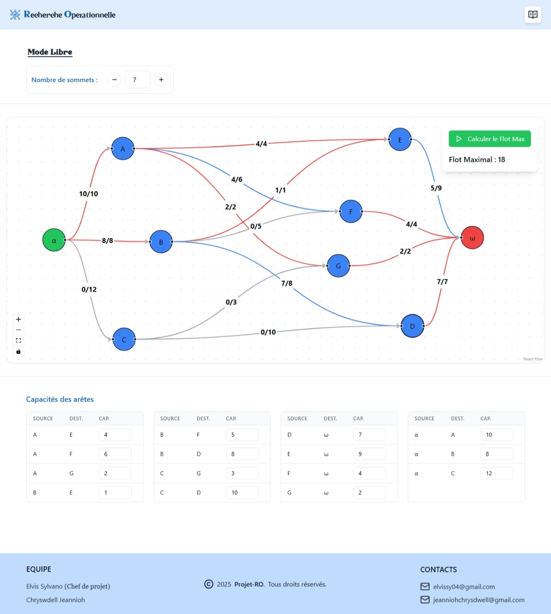

# 🔮 Projet de Résolution du Problème de Flot Maximal

Ce projet implémente un algorithme de résolution du **problème de flot maximal** dans un graphe orienté. Il permet de trouver la quantité maximale de flot qu'on peut faire passer d'une source vers un puits sans violer les capacités des arcs.

### ✨ [Live Demo](https://flot-maximal.vercel.app)

## 🚀 Fonctionnalités

- Détection automatique du flot maximal entre une source et un puits
- Visualisation du graphe
- Support des algorithmes classiques comme Ford-Fulkerson et MANUELBLOCH

## 📁 Contenus

- [`INSTALLATION.md`](./docs/INSTALLATION.md) : Instructions d'installation
- [`UTILISATION.md`](./docs/UTILISATION.md) : Comment utiliser l'application
- [`ALGORITHME.md`](./docs/ALGORITHME.md) : Détails sur les algorithmes utilisés

## 📷 Aperçu

